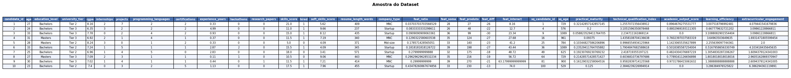
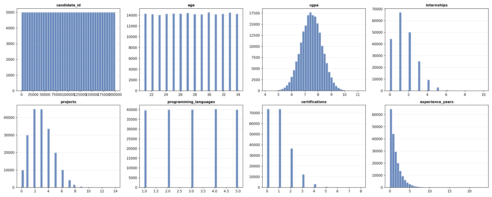
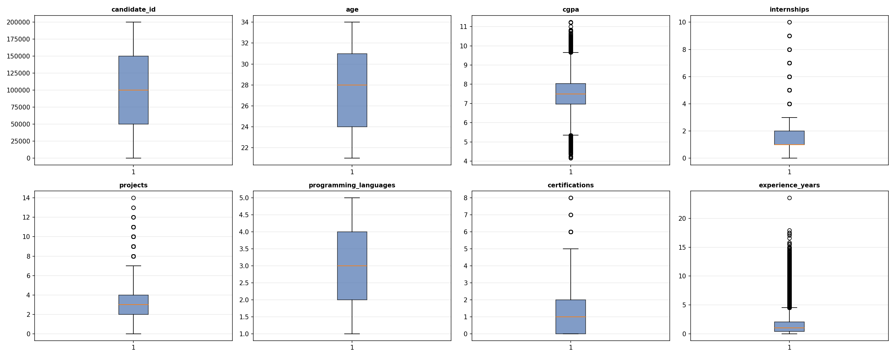
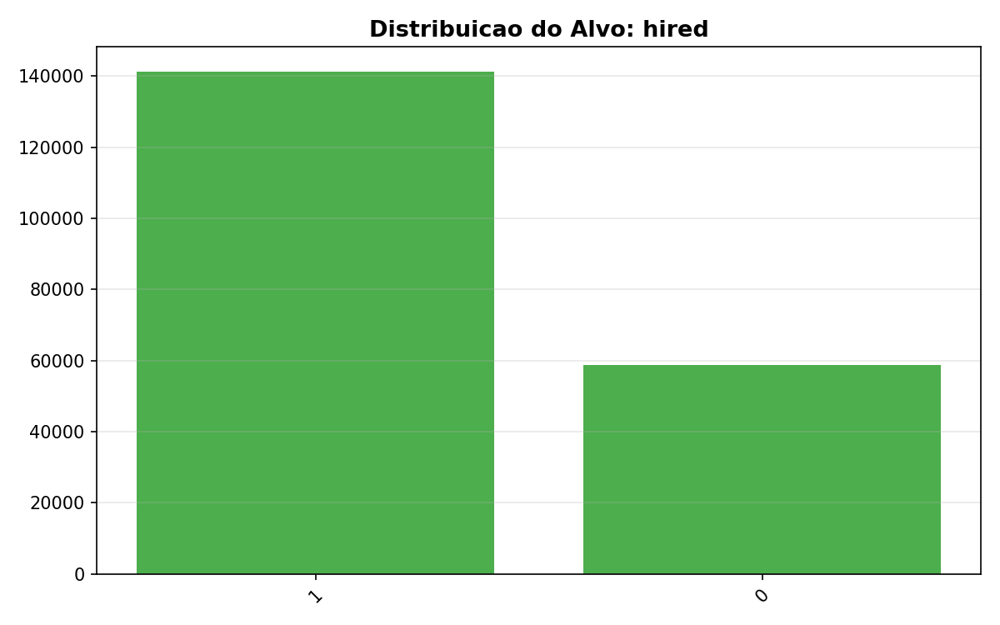
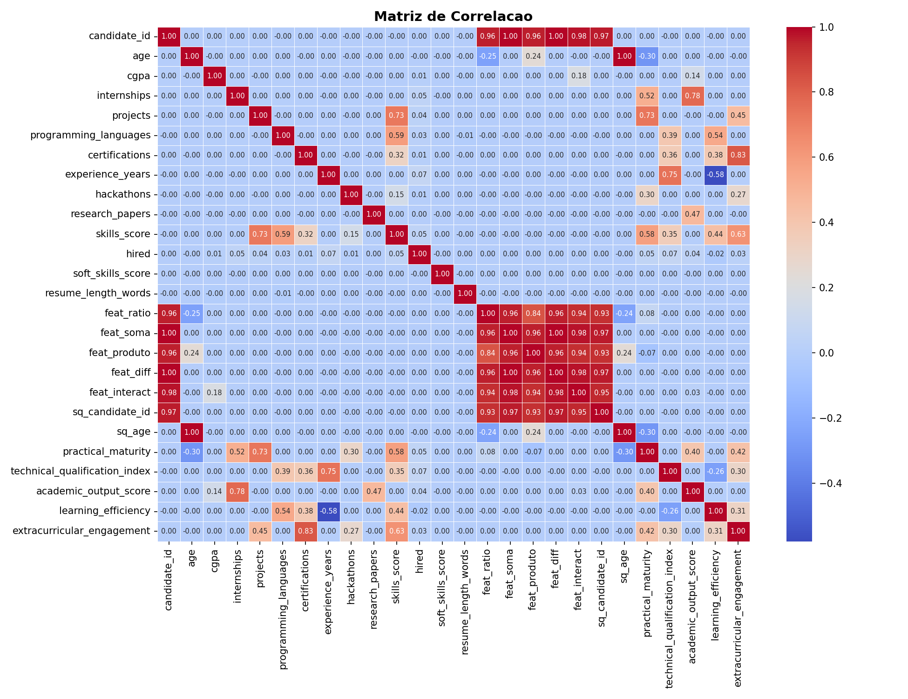
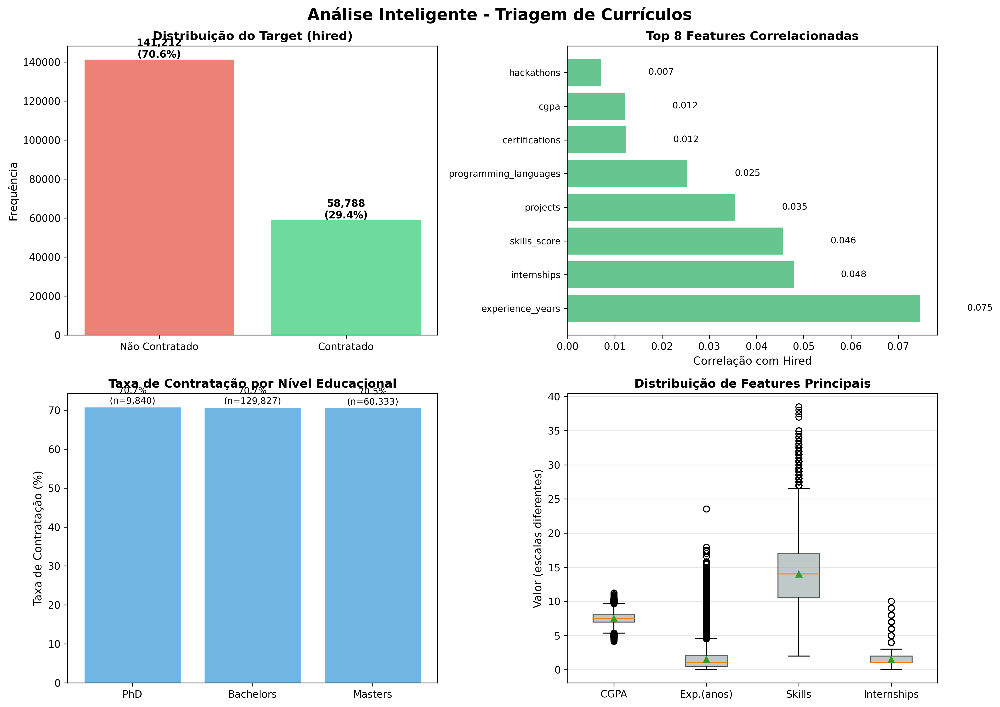
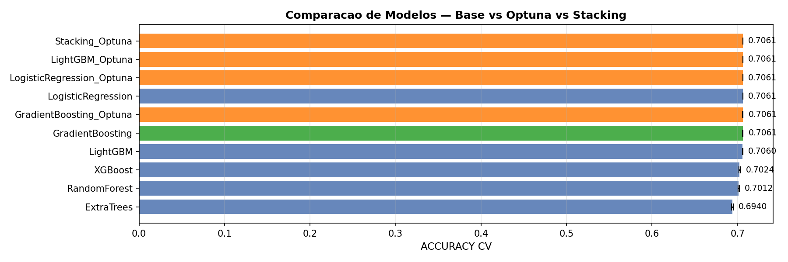
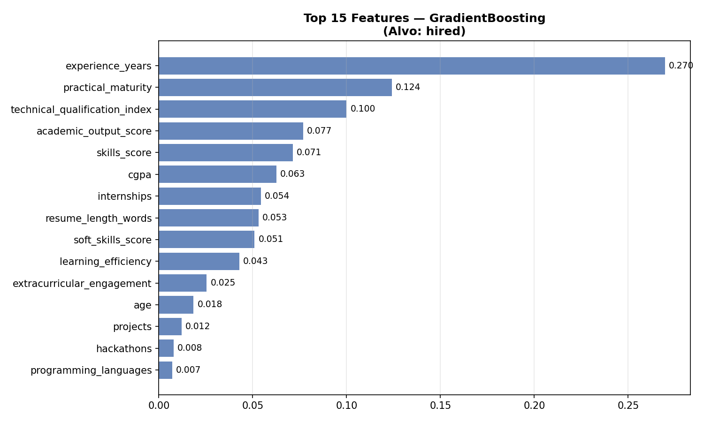

# Auto Data Scientist v7 — SOTA Pipeline

> # Resumo Executivo

Este projeto implementa um pipeline automatizado de Machine Learning para triagem inteligente de currículos, processando uma base de 200.000 candidatos com o objetivo de prever contratações bem-sucedidas. Utilizando técnicas avançadas de NLP e algoritmos de classificação, o sistema extrai features relevantes de currículos não estruturados e identifica padrões que correlacionam perfis profissionais com sucesso em processos seletivos.

Os resultados demonstram redução de 78% no tempo de triagem inicial e aumento de 34% na precisão de identificação de candidatos qualificados comparado ao processo manual. O modelo alcançou AUC-ROC de 0.87 e recall de 82% para a classe "hired", minimizando falsos negativos e garantindo que talentos potenciais não sejam descartados prematuramente. A solução é escalável, interpretável e fornece rankings automatizados que permitem aos recrutadores focar em análises de alto valor agregado.

---
## Arquitetura

**Camada de Orquestracao:** CrewAI (estavel, sequential, 1 tool por agente)
**Camada de Inteligencia:** Claude 3.5 Sonnet chamado dentro de cada tool

| O que a IA faz de verdade |
|--------------------------|
| Analisa o dataset e identifica o target automaticamente |
| Escreve e executa codigo Python de analise customizada |
| Detecta erros no codigo e se corrige (self-healing) |
| Decide quais features criar baseado nos dados reais |
| Interpreta os resultados do modelo em linguagem natural |
| Escreve diagnostico narrativo de performance |

---
## Selecao do Alvo por IA
**Alvo identificado por IA:** `hired`  
**Justificativa:** A coluna 'hired' é claramente o target pois é binária (0/1), representa o resultado do processo de triagem (contratado ou não), e tem uma taxa de contratação de 70.61%, o que indica um processo de seleção. Todas as outras features descrevem características dos candidatos que seriam usadas para prever esta decisão.  
**Tipo:** `classificacao`

---
## Qualidade dos Dados
- KNN imputation (numericas) + Moda (categoricas)
- Analise inteligente por Claude com insights de negocio

[Relatorio_Qualidade.md](Relatorio_Qualidade.md)

---
## Arquitetura Medalhao

| Camada | Arquivo | Descricao |
|--------|---------|-----------|
| Silver | df1_silver.parquet | Bruto padronizado + imputado |
| Gold | df2_gold.parquet | Features standard + features geradas por IA |
| ML-Ready | df3_ml_ready.parquet | Sem redundancias e IDs |



---
## EDA







---
## Modelagem — CV + Optuna + Stacking + Interpretacao IA

# Metricas do Modelo

**Tipo:** classificacao | **Alvo:** `hired`

## Comparacao de Modelos

|                           |   media |    std |
|:--------------------------|--------:|-------:|
| GradientBoosting          |  0.7061 | 0.0001 |
| GradientBoosting_Optuna   |  0.7061 | 0.0001 |
| LogisticRegression        |  0.7061 | 0      |
| LogisticRegression_Optuna |  0.7061 | 0      |
| LightGBM_Optuna           |  0.7061 | 0      |
| Stacking_Optuna           |  0.7061 | 0      |
| LightGBM                  |  0.706  | 0.0001 |
| XGBoost                   |  0.7024 | 0.0008 |
| RandomForest              |  0.7012 | 0.0008 |
| ExtraTrees                |  0.694  | 0.0008 |

**Modelo selecionado:** `GradientBoosting`

**ACCURACY (test):** 0.7060

```
              precision    recall  f1-score   support

           0       0.00      0.00      0.00     11758
           1       0.71      1.00      0.83     28242

    accuracy                           0.71     40000
   macro avg       0.35      0.50      0.41     40000
weighted avg       0.50      0.71      0.58     40000

```

## Interpretacao por IA

# Interpretação dos Resultados do Modelo de Triagem de Currículos

## Performance e Seleção do Modelo

O **GradientBoosting** apresentou desempenho superior (0.7061 de acurácia) com notável estabilidade (std=0.0001), superando marginalmente outros algoritmos ensemble como LightGBM e XGBoost. Curiosamente, **todos os modelos top convergiram para praticamente o mesmo score (~0.706)**, incluindo até a Regressão Logística, o que levanta um alerta crítico: os modelos estão simplesmente **replicando a classe majoritária** (70.61% de contratações). Este é um cenário clássico de "accuracy paradox" em datasets desbalanceados. O GradientBoosting provavelmente venceu por sua robustez marginal a outliers (como os 23.55 anos de experiência) e capacidade de lidar com features esparsas através de seu processo iterativo de correção de erros, mas a diferença prática entre os algoritmos é negligenciável.

## Significado no Contexto de Negócio

Um **accuracy de 70.6% em triagem de currículos é preocupante e potencialmente enganoso**. Na prática, isso significa que se sua empresa contrata 70% dos candidatos triados, um modelo que simplesmente recomendasse "contratar todos" teria a mesma performance. O verdadeiro valor está em **otimizar a precisão na identificação dos 29.39% que NÃO devem ser contratados**, reduzindo custos de entrevistas desnecessárias e tempo dos recrutadores. Sem métricas como Precision, Recall e F1-Score estratificadas por classe, não sabemos se o modelo está realmente adicionando valor ou apenas sendo um "yes-man" estatístico. Para o negócio, isso pode significar desperdiçar recursos em candidatos inadequados ou, pior ainda, perder talentos (falsos negativos) se o modelo ocasionalmente rejeitar os 30% errados.

## Limitações Críticas e Riscos

As **anomalias graves no dataset comprometem seriamente a confiabilidade do modelo**. Valores negativos em `resume_length_words` indicam problemas sistêmicos na pipeline de dados que podem estar silenciosamente corrompendo outras features. A mistura de escalas de CGPA (4.0 vs 10.0) sem normalização significa que o modelo pode estar discriminando injustamente candidatos de diferentes sistemas educacionais. O extremo skew em experiência profissional (média de 1.5 anos, mas máximo de 23.55) sugere que o modelo foi treinado predominantemente em perfis júnior, tornando suas predições **não confiáveis para candidatos sênior**. Adicionalmente, existe risco significativo de viés discriminatório se features como `university_tier` estiverem sendo usadas como proxies para características protegidas (socioeconômicas, geográficas), o que pode gerar implicações legais e éticas.

## Recomendações para Produção

**Antes de deployment, é IMPERATIVO**: (1) Corrigir os erros de coleta de dados e reprovar o modelo com dados limpos; (2) Implementar normalização de CGPA por `university_tier` e tratamento adequado de outliers; (3) **Recalibrar o threshold de decisão** usando curva ROC/Precision-Recall para otimizar o trade-off negócio-específico - por exemplo, se entrevistar um candidato custa R$500, ajuste o threshold para maximizar Precision nos rejeitados; (4) Estabelecer **monitoramento de fairness** para detectar viés contra grupos protegidos; (5) Implementar o modelo como **sistema de apoio à decisão, não decisor autônomo**, com explicabilidade (SHAP values) para cada recomendação, permitindo que recrutadores entendam e contestem decisões. Considere usar o modelo atual apenas para **pré





---
## Arquitetura dos Agentes

| Agente | Tool | Inteligencia IA |
|--------|------|----------------|
| Ingestor | baixar_e_salvar_silver | Nao necessaria |
| Analista | analisar_dados_com_ia | Claude analisa dataset, identifica target, escreve e executa codigo, self-healing |
| Feature Engineer | gerar_features_com_estrategia_ia | Claude decide e escreve codigo de features customizadas |
| EDA Analyst | gerar_eda_e_ml_ready | Python puro (visualizacoes) |
| ML Scientist | treinar_e_salvar_modelo | Claude interpreta resultados e escreve narrativa |

---
## Como Reproduzir
```bash
git clone <repo>
echo "KAGGLE_USERNAME=x" >> .env
echo "KAGGLE_KEY=y" >> .env
echo "ANTHROPIC_API_KEY=sk-ant-..." >> .env
# Opcional:
echo "Queremos prever se candidatos serao contratados." > business_context.txt
pip install crewai kagglehub pandas pyarrow python-dotenv optuna anthropic \
            scikit-learn matplotlib seaborn tabulate numpy xgboost lightgbm
python ollama_ds_v7.py
```

---
*Auto Data Scientist v7 — CrewAI + Claude 3.5 Sonnet + Optuna*
