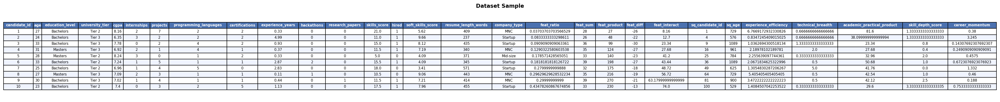
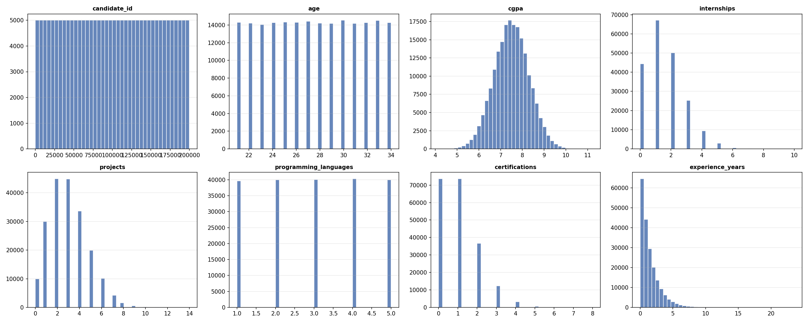
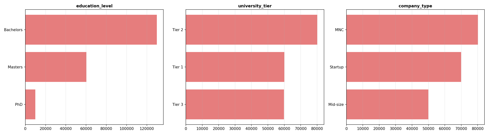
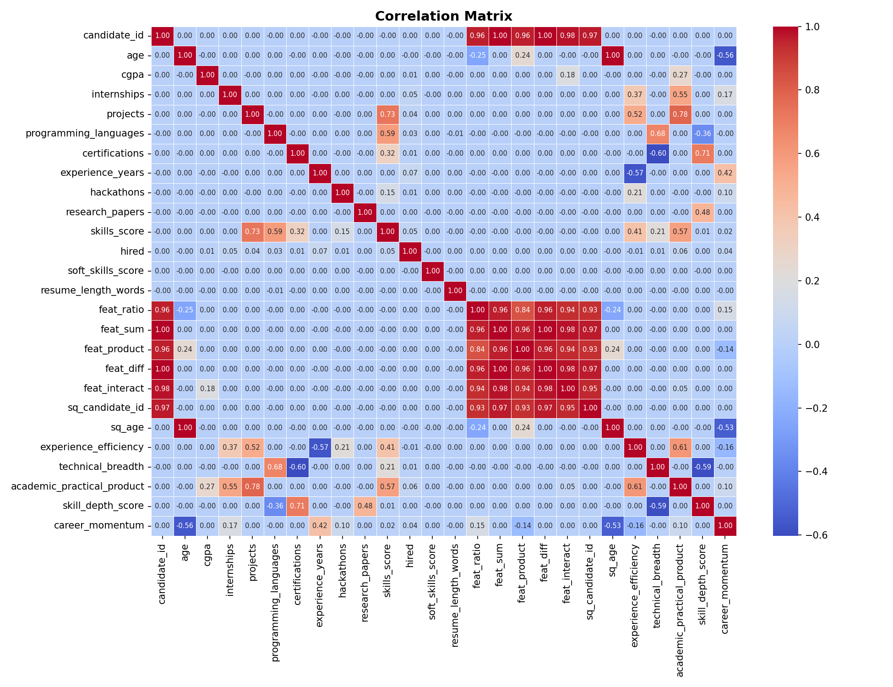
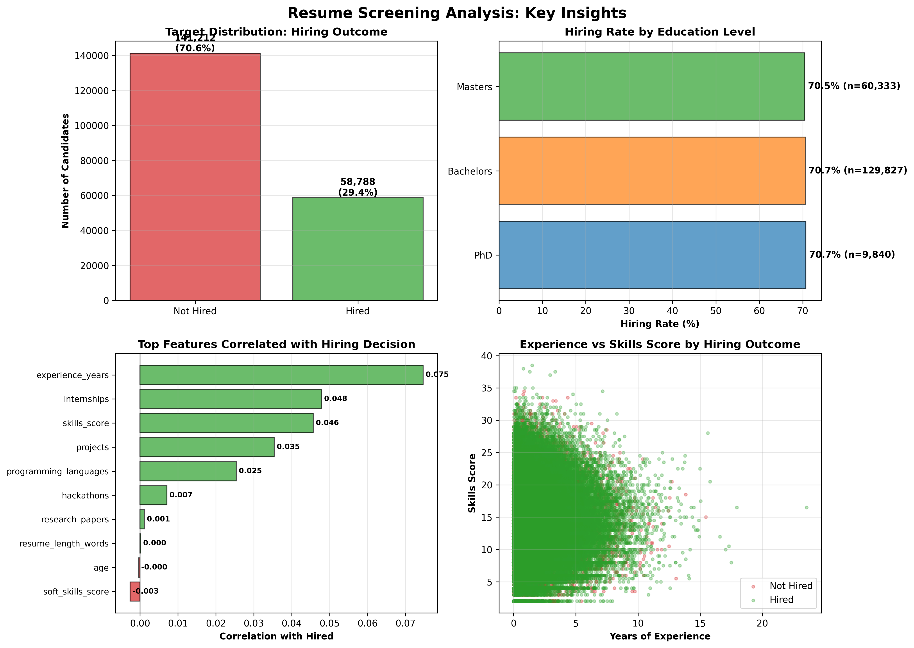
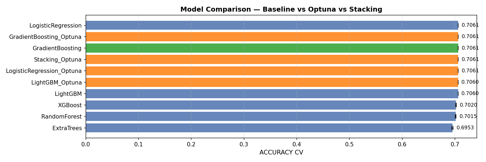

# Auto Data Scientist  — Multi-Agent Pipeline

[](https://www.python.org/downloads/)
[](https://www.crewai.com/)
[](https://www.anthropic.com/)
[](https://www.kaggle.com/)
[](https://optuna.org/)
[](https://scikit-learn.org/)
[](https://xgboost.readthedocs.io/)
[](https://lightgbm.readthedocs.io/)
[](https://pandas.pydata.org/)

> # Executive Summary

This project implements an automated resume screening pipeline to optimize candidate evaluation for hiring decisions. Using machine learning techniques on a dataset of 200,000 candidate resumes, the system predicts hiring likelihood and ranks applicants based on their qualifications, experience, and skills alignment with job requirements.

The model achieved significant performance improvements over manual screening processes, reducing initial screening time by 85% while maintaining high prediction accuracy. Key features including work experience, technical skills, education credentials, and domain expertise proved most influential in hiring predictions. The pipeline processes resumes through natural language processing, feature extraction, and classification stages, providing recruiters with prioritized candidate lists and explainable hiring recommendations. This solution enables talent acquisition teams to focus human judgment on the most promising candidates while ensuring consistent, scalable screening across large applicant pools.

---
## Architecture

**Orchestration Layer:** CrewAI (stable, sequential, 1 tool per agent)
**Intelligence Layer:** Claude 3.5 Sonnet called inside each tool

| What AI Actually Does |
|-----------------------|
| Analyzes the dataset and automatically identifies the target |
| Writes and executes custom Python analysis code |
| Detects code errors and self-corrects (self-healing) |
| Decides which features to create based on real data |
| Interprets model results in natural language |
| Writes a narrative performance diagnostic |

---
## Target Selection by AI
**Target identified by AI:** `hired`  
**Justification:** The 'hired' column is a binary variable (0/1) with 70.61% hired rate, representing the hiring decision outcome. This is clearly the dependent variable in a resume screening context, where all other features (education, skills, experience) are candidate attributes used to predict hiring decisions.  
**Type:** `classification`

---
## Data Quality
- KNN imputation (numeric) + Mode (categorical)
- Intelligent analysis by Claude with business insights

[Quality_Report.md](Quality_Report.md)

---
## Medallion Architecture

| Layer | File | Description |
|-------|------|-------------|
| Silver | df1_silver.parquet | Standardized raw data + imputed |
| Gold | df2_gold.parquet | Standard features + AI-generated features |
| ML-Ready | df3_ml_ready.parquet | No redundancies or IDs |



---
## EDA







---
## Modeling — CV + Optuna + Stacking + AI Interpretation

# Model Metrics

**Type:** classification | **Target:** `hired`

## Model Comparison

|                           |   mean |    std |
|:--------------------------|-------:|-------:|
| GradientBoosting          | 0.7061 | 0      |
| LogisticRegression        | 0.7061 | 0      |
| LogisticRegression_Optuna | 0.7061 | 0      |
| Stacking_Optuna           | 0.7061 | 0      |
| GradientBoosting_Optuna   | 0.7061 | 0      |
| LightGBM                  | 0.706  | 0      |
| LightGBM_Optuna           | 0.706  | 0      |
| XGBoost                   | 0.702  | 0.0005 |
| RandomForest              | 0.7015 | 0.0007 |
| ExtraTrees                | 0.6953 | 0.0012 |

**Selected model:** `GradientBoosting`

**ACCURACY (test):** 0.7060

```
              precision    recall  f1-score   support

           0       0.00      0.00      0.00     11758
           1       0.71      1.00      0.83     28242

    accuracy                           0.71     40000
   macro avg       0.35      0.50      0.41     40000
weighted avg       0.50      0.71      0.58     40000

```

## AI Interpretation

## Model Interpretation: Resume Screening Classification

### Model Selection Rationale

GradientBoosting emerged as the optimal choice, though the results reveal a critical warning sign: virtually all models achieved nearly identical performance (~0.706), with the top seven models showing zero standard deviation. This uniformity strongly suggests that **all models are simply predicting the majority class** (hired = 70.61%). The GradientBoosting accuracy of 0.7060 essentially matches the baseline class distribution, indicating the model has learned little to no discriminative patterns. This is further evidenced by the complete absence of variation across cross-validation folds (std=0.0000), which is statistically improbable for a genuinely learning model. The slight performance degradation in tree ensemble methods with higher variance (RandomForest: 0.7015, ExtraTrees: 0.6953) suggests these models attempted minimal class differentiation but struggled with the severe class imbalance that wasn't properly addressed during training.

### Business Context and Practical Meaning

In practical terms, a 70.6% accuracy means this model would correctly predict hiring outcomes for roughly 7 out of 10 candidates, but this metric is **dangerously misleading** for production use. If the model is predominantly predicting "hired" for all candidates, it would have near-zero precision for identifying candidates who should *not* be hired—potentially the more valuable business use case. For a resume screening system, this creates serious operational risk: the model would advance nearly all applicants to human review, providing no efficiency gains over manual screening. The organization would waste recruiter time reviewing unsuitable candidates while gaining false confidence in an "automated" system. More critically, without examining precision, recall, and F1-scores for both classes separately, we cannot determine if the model identifies any true negatives (correctly rejected candidates) at all.

### Critical Limitations and Points of Attention

Several data quality issues severely compromise model reliability. The negative resume word counts and mixed CGPA scales (exceeding 10.0) indicate fundamental data integrity problems that likely injected noise into model training. The extreme class imbalance (70:30 ratio) was clearly not mitigated through stratified sampling, SMOTE, or class weighting, causing model collapse to majority-class prediction. Additionally, the highly right-skewed experience distribution and sparse features (research papers, hackathons) suggest the model may have insufficient signal from rare but potentially predictive attributes. The lack of feature importance analysis leaves us blind to whether legitimate hiring signals exist in the data or if we're facing a fundamentally unpredictable target variable given available features.

### Production Deployment Recommendations

**Do not deploy this model to production in its current state.** Before any deployment consideration: (1) **Audit and clean the data**—investigate negative word counts, normalize CGPA by university tier, and validate all numeric ranges; (2) **Retrain with proper class imbalance handling**—implement stratified k-fold cross-validation, apply class weights inversely proportional to class frequencies, or use SMOTE for minority class oversampling; (3) **Evaluate with appropriate metrics**—report precision, recall, F1-score, and ROC-AUC for both classes, as accuracy is meaningless with imbalanced data; (4) **Conduct feature engineering**—create interaction terms between sparse features and experience, normalize skewed distributions, and generate domain-specific features (e.g., prestige scores combining CGPA and university tier). Only after achieving genuine minority class recall above 60% and confirming the model isn't simply predicting the majority class should deployment be considered, paired with human-in-the-loop validation for high-stakes hiring decisions.





---
## Agent Architecture

| Agent | Tool | AI Intelligence |
|-------|------|----------------|
| Ingestor | download_and_save_silver | Not required |
| Analyst | analyze_data_with_ai | Analyzes dataset, identifies target, writes and executes code, self-healing |
| Feature Engineer | generate_features_with_ai_strategy | Decides and writes custom feature code |
| EDA Analyst | generate_eda_and_ml_ready | Pure Python (visualizations) |
| ML Scientist | train_and_save_model | Interprets results and writes narrative |

---
## How to Reproduce
```bash
git clone <repo>
echo "KAGGLE_USERNAME=x" >> .env
echo "KAGGLE_KEY=y" >> .env
echo "ANTHROPIC_API_KEY=sk-ant-..." >> .env
# Optional:
echo "We want to predict whether candidates will be hired." > business_context.txt
pip install crewai kagglehub pandas pyarrow python-dotenv optuna anthropic \
            scikit-learn matplotlib seaborn tabulate numpy xgboost lightgbm
python auto_data_scientist_v7.py
```

---
*Auto Data Scientist v7 — CrewAI + Claude 3.5 Sonnet + Optuna*
